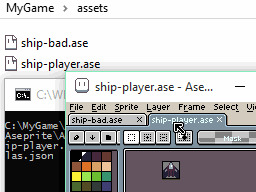

# Aseprite 命令行界面

可以通过命令行将精灵转换或导出为其他格式（或纹理+json 数据）。请参阅[平台特定细节](#平台特定细节)部分，了解如何使用命令行。

* [选项](#选项)
* [用例](#用例)
* [平台特定细节](#平台特定细节)
* [自动化处理流程](#自动化处理流程)



## 选项

<pre>
用法:
  aseprite.exe [选项] [文件]...
选项:
      --<a href="#shell">shell</a>                  启动交互式控制台以执行脚本
  -b, --<a href="#batch">batch</a>                  不启动用户界面
  -p, --<a href="#preview">preview</a>                不执行操作，仅打印将要执行的操作
      --<a href="#save-as">save-as</a> &lt;文件名&gt;     使用其他格式保存最后给出的精灵
      --<a href="#palette">palette</a> &lt;文件名&gt;     更改最后给出的精灵的调色板
      --<a href="#scale">scale</a> &lt;因子&gt;         调整所有先前打开的精灵的大小
      --<a href="#dithering-algorithm">dithering-algorithm</a> &lt;算法&gt;
                               在 --color-mode 中用于将图像从 RGB 转换为索引色的抖动算法
      --<a href="#dithering-matrix">dithering-matrix</a> &lt;矩阵&gt;
                               有序抖动算法中使用的矩阵
      --<a href="#color-mode">color-mode</a> &lt;模式&gt;      更改所有先前打开的精灵的颜色模式：
                                 rgb
                                 grayscale
                                 indexed
      --<a href="#data">data</a> &lt;文件名.json&gt;   用于存储精灵表元数据的文件
      --<a href="#format">format</a> &lt;格式&gt;        导出数据文件的格式 (json-hash, json-array)
      --<a href="#sheet">sheet</a> &lt;文件名.png&gt;   用于保存纹理的图像文件
      --<a href="#sheet-type">sheet-type</a>             创建精灵表的算法：
                                 horizontal
                                 vertical
                                 rows
                                 columns
                                 packed
      --<a href="#sheet-width">sheet-width</a> &lt;像素&gt;   精灵表宽度
      --<a href="#sheet-height">sheet-height</a> &lt;像素&gt;  精灵表高度
      --<a href="#sheet-columns">sheet-columns</a> &lt;列数&gt;
      --<a href="#sheet-rows">sheet-rows</a> &lt;行数&gt;
      --<a href="#sheet-pack">sheet-pack</a>             使用打包算法以避免在纹理中浪费空间
      --<a href="#split-layers">split-layers</a>           将下一个给定精灵的每个图层作为独立图像导入到精灵表中
      --<a href="#split-tags">split-tags</a>             将每个标签保存为独立文件
      --<a href="#split-slices">split-slices</a>           将每个切片保存为独立文件
      --<a href="#split-grid">split-grid</a>             将每个网格图块保存为独立文件
      --<a href="#layer">layer</a> &lt;名称&gt; 或
      --<a href="#layer">import-layer</a> &lt;名称&gt;    在精灵表中仅包含指定图层
      --<a href="#all-layers">all-layers</a>             使所有图层可见
                               默认情况下，隐藏图层将被忽略
      --<a href="#ignore-layer">ignore-layer</a> &lt;名称&gt;    在精灵表或另存为操作中排除指定图层
      --<a href="#tag">tag</a> &lt;名称&gt;
      --<a href="#tag">frame-tag</a> &lt;名称&gt;       在精灵表中包含带标签的帧
      --<a href="#frame-range">frame-range</a> 起始,结束    仅导出 [起始,结束] 范围内的帧
      --<a href="#ignore-empty">ignore-empty</a>           不导出空帧/空 Cel
      --<a href="#merge-duplicates">merge-duplicates</a>       在精灵表中将所有重复帧合并为一个
      --<a href="#border-padding">border-padding</a> &lt;值&gt; 在纹理边框添加填充
      --<a href="#shape-padding">shape-padding</a> &lt;值&gt;  在帧之间添加填充
      --<a href="#inner-padding">inner-padding</a> &lt;值&gt;  在每个帧内部添加填充
      --<a href="#trim">trim</a>                   为 --save-as 修剪整个精灵，或为 --sheet 修剪各个帧
      --<a href="#trim-sprite">trim-sprite</a>            修剪整个精灵（用于 --save-as 和 --sheet）
      --<a href="#trim-by-grid">trim-by-grid</a>           在导出前按每个图像对应的网格边界对其进行修剪
      --<a href="#extrude">extrude</a>                对所有图像进行扩展，将所有边缘复制一个像素
      --<a href="#crop">crop</a> x,y,宽度,高度  将所有图像裁剪到给定的矩形区域
      --<a href="#slice">slice</a> &lt;名称&gt;           将精灵裁剪到给定的切片区域
      --<a href="#filename-format">filename-format</a> &lt;格式&gt;  用于生成文件名的特殊格式
      --<a href="#tagname-format">tagname-format</a> &lt;格式&gt;   用于在 JSON 数据中生成标签名的特殊格式
      --<a href="#script">script</a> &lt;文件名&gt;      执行指定的脚本
      --<a href="#script-param">script-param</a> 名称=值
                               通过 CLI 执行的脚本的参数，可以通过 app.params 访问
      --<a href="#list-layers">list-layers</a>            列出下一个给定精灵的图层
                               或在 JSON 数据中包含图层信息
      --<a href="#list-layer-hierarchy">list-layer-hierarchy</a>   列出下一个给定精灵的图层及其分组
                               或在 JSON 数据中包含图层层次结构
      --<a href="#list-tags">list-tags</a>              列出下一个给定精灵的标签
                               或在 JSON 数据中包含帧标签
      --<a href="#list-slices">list-slices</a>            列出下一个给定精灵的切片
                               或在 JSON 数据中包含切片
      --<a href="#oneframe">oneframe</a>               仅加载第一帧
      --<a href="#export-tileset">export-tileset</a>         仅从可见的 tilemap 图层导出 tileset
  -v, --<a href="#verbose">verbose</a>                详细解释正在执行的操作
      --<a href="#debug">debug</a>                  极端详细模式，并将日志复制到桌面
      --<a href="#noinapp">noinapp</a>                在 Steam 上禁用"游戏中"状态
                               不记录游戏时间
  -?, --<a href="#help">help</a>                   显示此帮助信息并退出
      --<a href="#version">version</a>                输出版本信息并退出
</pre>


### --shell

在 [REPL 模式](https://en.wikipedia.org/wiki/Read%E2%80%93eval%E2%80%93print_loop)下执行 Aseprite。在此模式下使用[脚本 API](//www.aseprite.org/api) 编写 Lua 代码。

### --batch

运行 Aseprite 仅用于处理命令行选项，然后结束。如果你通过脚本运行 Aseprite 来自动生成精灵表、转换图像等，这个选项特别有用。示例：

```bash
aseprite --batch
```

或者使用更简短的形式：

```bash
aseprite -b
```

### --previewbash

在 **v1.2-beta2** 中：仅显示将要执行的操作（不修改磁盘上的文件）。

```bash
aseprite --preview ...
```

### --save-as

使用给定的文件名保存最后打开的文档。这就像从界面调用`文件 > 另存为`。示例：

```bash
aseprite -b sprite.ase --save-as frame001.png
```

将为 `sprite.ase` 中的每一帧生成 `frame001.png`、`frame002.png` 等文件。

在 **v1.2-beta1** 中：直接在文件名中指定 [--filename-format](#filename-format) 参数。例如：

```bash
aseprite -b sprite.ase --save-as layer-{layer}-frame-{frame01}.png
```

这相当于隐式使用了 [--split-layers](#split-layers) 和 [--filename-format](#filename-format)。

### --palette

在 **v1.2-beta2** 中：更改命令行中最后给出的精灵的调色板。这可用于使用不同调色板保存同一个精灵：

```bash
aseprite -b ryu-template.png --palette pal1.png --save-as ryu1.png --palette pal2.png --save-as ryu2.png
```

在 **v1.1** 中，此参数曾用于更改默认程序调色板，但现在可以通过 *[保存为默认调色板](./default-palette.md)* 菜单选项来完成。

### --scale

```bash
aseprite ... --scale 因子
```

使用命令行中 `--scale` 选项前指定的`因子`来调整所有图像的大小。示例：

```bash
aseprite -b original.png --scale 2 --save-as image-x2.png
```

### --dithering-algorithm

```bash
aseprite -b sprite.ase --dithering-algorithm 算法
```

在 [--color-mode indexed](#color-mode) 中用于将图像从 RGB 转换为索引色的抖动算法。

* `--dithering-algorithm none`
* `--dithering-algorithm ordered`
* `--dithering-algorithm old`

### --dithering-matrix

```bash
aseprite -b sprite.ase --dithering-matrix 矩阵
```

用于 [--dithering-algorithm](#dithering-algorithm) 和 [--color-mode indexed](#color-mode) 的抖动矩阵，用以将图像从 RGB 转换为索引色。`矩阵`可以是：

* `--dithering-matrix bayer8x8`
* `--dithering-matrix bayer4x4`
* `--dithering-matrix bayer2x2`
* 或者是已安装扩展中其他抖动矩阵的标识符 (`id`)。

这些默认的抖动矩阵（`bayer8x8` 等）位于 Aseprite 的 [bayer-matrices](https://github.com/aseprite/aseprite/tree/master/data/extensions/bayer-matrices) 扩展中，这些 id 在其 [package.json](https://github.com/aseprite/aseprite/blob/master/data/extensions/bayer-matrices/package.json#L10) 文件中定义。

### --color-mode

```bash
aseprite -b sprite.ase --color-mode 模式
```

将所有先前打开的精灵的颜色模式更改为给定的`模式`。`模式`可以是：

* `--color-mode rgb`
* `--color-mode grayscale`
* `--color-mode indexed`

请记住，[--dithering-algorithm](#dithering-algorithm) 和 [--dithering-matrix](#dithering-matrix) 将影响 RGB → 索引色的转换。

示例：

```bash
aseprite -b idx-sprite.ase --color-mode rgb --save-as rgb-output.png
aseprite -b rgb-sprite.ase --dithering-algorithm ordered --dithering-matrix bayer8x8 --color-mode indexed --save-as idx-output.png
```

### --data

```bash
aseprite.exe ... --sheet file.png --data file.json
```

以 JSON 格式保存有关导出的精灵表的信息。[输出示例。](https://gist.github.com/dacap/db18e5747a4b6e208d3c)

请参阅 [--sheet](#sheet) 选项以更改精灵表图像的目标位置。

JSON 数据也可以通过显式使用空文件名（即 `--data=""`）直接写入 stdout。

```bash
aseprite.exe ... --data="" animations.ase
```

### --format

更改用于保存由 [--data](#data) 选项指定的精灵表数据的格式。可用的格式有：

* `--format json-hash` (默认格式) ([示例](https://gist.github.com/dacap/db18e5747a4b6e208d3c))
* `--format json-array` ([示例](https://gist.github.com/dacap/a32adb9248320326733a))

### --sheet

```bash
aseprite ... --sheet 精灵表.png
```

将命令行中 `--sheet` 选项之前指定的所有图像导出到 `精灵表.png` 图像文件中（该文件将被覆盖）。

请参阅 [--data](#data) 选项以更改精灵表 JSON 数据的目标位置。

### --sheet-width

为 [--sheet](#sheet) 中的精灵表指定一个固定的宽度（以像素为单位）。

### --sheet-height

为 [--sheet](#sheet) 中的精灵表指定一个固定的高度（以像素为单位）。

### --sheet-type

使用 [--sheet](#sheet) 时的精灵表类型：

* `horizontal`
* `vertical`
* `rows`
* `columns`
* `packed` (与 [--sheet-pack](#sheet-pack) 相同)

### --sheet-pack

使用一种特殊的打包算法，以避免在精灵表中浪费空间。

### --split-layers

分割命令行中**下一个文档**的可见图层，这样你就可以将每个图层保存为独立的图像/项目。它会影响 [--sheet](#sheet) 和 [--save-as](#save-as) 选项。
**警告**：`--split-layers` 选项必须放在**你的精灵文件之前**。

* 示例：

  ```bash
  aseprite.exe -b --split-layers with-layers.ase --save-as output1.png
  ```

  请注意，`--split-layers` 必须在 `with-layers.ase` 之前。在这个例子中，如果 `with-layers.ase` 包含 3 帧以及图层 `Background` 和 `Layer 1`，则以下命令将生成 6 个文件（每个帧/图层一个）：
  
  ```
  output (Background) 1.png
  output (Background) 2.png
  output (Background) 3.png
  output (Layer 1) 1.png
  output (Layer 1) 2.png
  output (Layer 1) 3.png
  ```

自 **v1.2-beta1** 起：如果你在 [--save-as](#save-as) 的文件名中指定了 `{layer}`，则会隐式使用 `--split-layers`。例如

```bash
aseprite.exe -b with-layers.ase --save-as output-{layer}-{frame}.png
```

要保存隐藏图层，将此选项与 [--all-layers](#all-layers) 选项结合使用：

```bash
aseprite.exe -b --all-layers with-layers.ase --save-as output-{layer}-{frame}.png
```

### --split-tags

自 **v1.2-beta8** 起，将下一个文档的标签分割到不同的文件中。它会影响 [--save-as](#save-as) 选项。效果等同于：

```bash
aseprite.exe -b animations.ase --save-as animations-{tag}.gif
```

### --split-slices

自 **v1.2-beta8** 起，将下一个文档的切片分割到不同的文件中。它会影响 [--save-as](#save-as) 选项。效果等同于：

```bash
aseprite.exe -b sheet.ase --save-as part-{slice}.png
```

### --split-grid

```bash
aseprite -b --split-grid tilemaps.png --sheet tiles.png
```

自 **v1.3-beta21** 起：指示 [--sheet](#sheet) 应将给定文件的每个网格单元作为精灵表中的独立精灵导出。

### --layer

仅选择一个图层进行导出（隐藏所有其他图层）。它会影响 [--sheet](#sheet) 和 [--save-as](#save-as) 选项。

```bash
aseprite.exe -b --layer "Body Layer" with-layers.ase --save-as body-layer.gif
```

保存一个仅显示名为 `Body Layer` 图层的 `body-layer.gif` 动画。

在 **v1.2-beta2** 中，指定多个图层和/或组：

```bash
aseprite.exe -b --layer "head/hat" --layer "body/gloves" player.ase --save-as clothes.gif
```

将保存一个 `clothes.gif` 动画，仅显示 `hat` 图层（它是 `head` 组的子级）和 `gloves` 图层（它是 `body` 组的子级）。

### --all-layers

```bash
aseprite -b ... --all-layers ...
```

为 [--save-as](#save-as)/[--sheet](#sheet) 操作包含/显示所有图层。如果你的精灵包含隐藏图层，但你希望也导出这些图层，则可以使用此选项。

示例：

```bash
aseprite -b --all-layers player.aseprite --save-as player-{layer}-{frame}.png
```

### --ignore-layer

```bash
aseprite -b ... --ignore-layer 图层名 ...
```

为 [--save-as](#save-as)/[--sheet](#sheet) 操作隐藏特定图层，以用于最终结果/渲染。

你必须在打开 `.aseprite` 文件之前指定此参数。
示例：

```bash
aseprite -b --ignore-layer "Guides Layer" player.aseprite --save-as player.gif
```

### --tag

仅导出给定标签内的帧。在 **v1.1** 中，它适用于 [--sheet](#sheet)；自 **v1.2-beta1** 起，它也适用于 [--save-as](#save-as)。

示例：

```bash
aseprite -b --tag "Run Cycle" several-animations.ase --save-as run-cycle.gif
```

### --frame-range

仅导出给定的 `[起始, 结束]` 范围内的帧。

### --ignore-empty

忽略空白帧/图层。它会影响 [--sheet](#sheet) 选项。

在 **v1.2.10-beta3** 中：它也会影响 [--save-as](#save-as)。

### --border-padding

```bash
aseprite ... --border-padding N ...
```

为整个精灵表添加 N 像素的边框。仅影响 [--sheet](#sheet) 选项。


### --shape-padding

```bash
aseprite ... --shape-padding N ...
```

在每个帧之间添加 N 像素的间距。仅影响 [--sheet](#sheet) 选项。


### --inner-padding

```bash
aseprite ... --inner-padding N ...
```

为每个帧添加 N 像素的边框。仅影响 [--sheet](#sheet) 选项。


### --trim

在保存精灵/图层/Cel 之前移除其边框。（即对要导出的每个图像执行 *编辑 > 修剪* 选项。）它会影响 [--sheet](#sheet) 和 [--save-as](#save-as) 选项。

### --crop

```bash
aseprite ... --crop X,Y,宽度,高度
```

仅从所有精灵/图层/Cel 中导出指定的矩形区域。它会影响 [--sheet](#sheet) 和 [--save-as](#save-as) 选项。

### --extrude

自 **v1.2-beta21** 起：对将使用 [--sheet](#sheet) 导出的所有图像/精灵进行扩展，将所有边缘复制一个像素。

### --slice

自 **v1.2-beta8** 起：

```bash
aseprite ... --slice 切片名
```

仅导出由给定切片指定的区域。它会影响 [--save-as](#save-as) 选项。

### --filename-format

```bash
aseprite --filename-format 格式
```

此选项指定用于格式化在 [--sheet](#sheet) 上生成的精灵表文件名或由 [--save-as](#save-as) 生成的文件的特殊字符串。

`格式`字符串可以包含一些特殊值：

* `{fullname}`：原始精灵的完整文件名（路径 + 文件名 + 扩展名）。
* `{path}`：文件名的路径。例如，如果精灵文件名为 `C:\game-assets\file.ase`，此项将为 `C:\game-assets`。
* `{name}`：文件名的名称（包含扩展名）。例如，如果精灵文件名为 `C:\game-assets\file.ase`，此项将为 `file.ase`。
* `{title}`：文件名中不含扩展名的部分。例如，如果精灵文件名为 `C:\game-assets\file.ase`，此项将为 `file`。
* `{extension}`：文件名的扩展名。例如，如果精灵文件名为 `C:\game-assets\file.ase`，此项将为 `ase`。
* `{layer}`：当前图层名称。
* `{tag}`：当前标签名称。
* `{innertag}`：最内层/最小的当前标签名称。
* `{outertag}`：最外层/最大的当前标签名称。
* `{frame}`：当前帧（从 `0` 开始）。使用 `{frame1}` 从 1 开始，或其他格式如 `{frame000}`、`{frame001}` 等。
* `{tagframe}`：当前标签中的当前帧。对于标签的第一帧，它为 `0`，以此类推。与 `{frame}` 类似，它也接受 `{tagframe000}` 等变体。
* `{duration}` 当前帧的持续时间。

例如，如果 `animation-with-layers.ase` 包含三帧，每帧有两个图层（名为 `Face` 和 `Background`）：

```bash
aseprite -b animation-with-layers.ase --filename-format '{path}/{title}-{layer}-{frame}.{extension}' --save-as output.png
```

将生成如下文件：

    output-Face-0.png
    output-Face-1.png
    output-Face-2.png
    output-Background-0.png
    output-Background-1.png
    output-Background-2.png

在 **v1.2-beta1** 中：在同一个 [--save-as](#save-as) 参数中指定文件名格式。

### --script

```bash
aseprite -script 文件名.lua
```

从命令行执行给定的脚本。

### --script-param

这是一种向 [`app.params`](https://github.com/aseprite/api/blob/master/api/app.md#appparams) 表添加元素的方法：

```bash
aseprite -b -script-param key1=value1 -script test.lua
```

然后是 `test.lua`

```lua
if app.params["key1"] == "value1" then
  ...
end
```

### --list-layers

```bash
aseprite --list-layers file.ase
```

打印给定文件中从下到上的图层列表。例如：


```bash
C:....> aseprite -b --list-layers file.ase
Background
Layer 1
Layer 2
```

当与 --data 一起使用时，图层将在 JSON 输出的 `meta` 属性中可用。例如：

```json
{ "frames": [
  ...
 ],
 "meta": {
  ...,
  "layers": [
   { "name": "Background" },
   { "name": "Layer 1" },
   { "name": "Layer 2" }
  ]
 }
}
```

### --list-layer-hierarchy

```bash
aseprite --list-layer-hierarchy file.ase
```

打印给定文件中从下到上的图层及其分组的列表。例如：


```bash
C:....> aseprite -b --list-layer-hierarchy file.ase
Layer 2
Group 1/
Layer 1.1
```

当与 --data 一起使用时，图层层次结构将在 JSON 输出的 `meta` 属性中可用。与 --list-layers 类似，例如：

```json
{ "frames": [
  ...
 ],
 "meta": {
  ...,
  "layers": [
   { "name": "Layer 2" },
   { "name": "Layer 1.1", "group": "Group 1"}
  ]
 }
}
```


### --list-tags

```bash
aseprite --list-tags file.ase
```

打印给定文件中从第一个到最后一个的标签列表。例如：


```bash
C:\....> aseprite -b --list-tags file.ase
Walk
Run
```

当与 --data 一起使用时，标签将在 JSON 输出的 `meta` 属性中可用。例如：

```json
{ "frames": [
  ...
 ],
 "meta": {
  ...,
  "frameTags": [
   { "name": "Walk", "from": 0, "to": 3 },
   { "name": "Run", "from": 4, "to": 6 }
  ]
 }
}
```

### --list-slices

> [!tip]
>
> 自 **v1.2-beta8** 起

```
aseprite --list-slices file.ase
```

打印给定文件中的切片列表。

当与 --data 一起使用时，切片将在 JSON 输出的 `meta` 属性中可用。例如：

```json
{ "frames": [
  ...
 ],
 "meta": {
  ...,
  "slices": [
    { "name": "cursor",
      "color": "#0000ffff",
      "keys": [{ "frame": 0,
                 "bounds": {"x": 80, "y": 0, "w": 16, "h": 16 },
                 "center": {"x": 2, "y": 2, "w": 12, "h": 12 },
                 "pivot": {"x": 8, "y": 8 } }] },
    ...
  ]
 }
}
```

### --oneframe

```bash
aseprite -b --oneframe frame1.png --save-as frame1.pcx
aseprite -b --oneframe walk-animation.aseprite --save-as walk-thumbnail.png
```

在 **v1.2-beta4** 中：仅加载动画的第一帧。这对于加载图像序列中的一帧（例如，当 `frame2.png`、`frame3.png` 等存在时仅加载 `frame1.png`）或仅加载整个动画的第一帧（例如，用于创建动画的缩略图）很有用。

### --export-tileset

```bash
aseprite -b --export-tileset tilemaps.aseprite --sheet tilesets-sprite-sheet.png
```

自 **v1.3-beta21** 起：指示 --sheet 应导出给定精灵中可见/已过滤图层的 tileset。

### --debug

如果你在命令行中使用 `--debug` 参数执行 Aseprite，一个名为 `Aseprite-v1.1-dev-DebugOutput.txt` 的特殊文件将在你的桌面上创建，其中可能包含用于了解发生了什么问题的有用信息（例如，这在程序无法正常启动时有助于了解发生了什么情况）。

在 Steam 上，[从 Aseprite 属性](http://imgur.com/txXcgzO)中添加此 `--debug` 选项。

### --noinapp

避免连接或启动 Steam 客户端。这会禁用 Steam 上的"游戏中"状态。

### --verbose

```bash
aseprite --verbose
```

它将在 `aseprite.log` 文件中记录更多信息：

- 在 Windows 上：`aseprite.log` 位于 `%AppData%\Aseprite\aseprite.log`
- 在 macOS 和 Linux 上：`aseprite.log` 位于 `~/.config/aseprite/aseprite.log`

### --help

```bash
aseprite --help
```

在控制台输出中显示可用的命令行选项。

### --version

```bash
aseprite --version
```

显示 Aseprite 版本。

## 用例

### 将 Aseprite 文件转换为 PNG、GIF 等格式。

```bash
aseprite.exe -b image.ase --save-as image.png
aseprite.exe -b animation.ase --save-as animation.gif
```

### 将动画转换为一系列 PNG 文件（frame1.png, frame2.png, 等）

```bash
aseprite.exe -b animation.ase --save-as frame1.png
```

### 将一个精灵调整为多个尺寸

```bash
aseprite.exe -b original.ase --scale 2 --save-as output-x2.png
aseprite.exe -b original.ase --scale 4 --save-as output-x4.png
aseprite.exe -b original.ase --scale 6 --save-as output-x6.png
aseprite.exe -b original.ase --scale 8 --save-as output-x8.png
```

### 将一个图层导出为 PNG/GIF 文件

```bash
aseprite.exe -b --layer "Layer 1" animation.ase --save-as output-Layer-1.gif
```

### 将所有图层导出为不同的 PNG/GIF 文件

如果 `animation.ase` 包含 3 帧以及图层 `Background` 和 `Layer 1`，则以下命令将生成 6 个文件（每个帧/图层一个）：

```bash
aseprite.exe -b --split-layers animation.ase --save-as output1.png
```

生成的文件将是：

```
output (Background) 1.png
output (Background) 2.png
output (Background) 3.png
output (Layer 1) 1.png
output (Layer 1) 2.png
output (Layer 1) 3.png
```

在 **v1.2-beta1** 中：通过类似以下的方式隐式指定 --split-layers 和 --filename-format：

```bash
aseprite.exe -b animation.ase --save-as output-{layer}.png
```

### 将动画导出为精灵表

```bash
aseprite.exe -b animation.ase --sheet sheet.png --data sheet.json
```

### 将每个图层作为同一精灵表中的不同动画导出

```bash
aseprite.exe -b --split-layers animation-with-layers.ase --sheet sheet.png --data sheet.json
```

### 从精灵中导出特定图层

```bash
aseprite.exe -b --layer=Background sprite.ase --sheet sheet.png --data sheet.json
```

### 从多个精灵创建纹理图集

```bash
aseprite.exe -b *.ase --sheet-pack --sheet atlas-bestfit.png --data atlas-bestfit.json
aseprite.exe -b *.ase --sheet-pack --sheet-width=1024 --sheet-height=1024 --sheet atlas-1024x1024.png --data atlas-1024x1024.json
```

## 平台特定细节

在 Windows 上，如果你安装了程序，它应该位于 `Program Files` 文件夹中，请尝试以下命令：

```
"C:\Program Files (x86)\Aseprite\Aseprite.exe" --help
```

或者

```
"C:\Program Files\Aseprite\Aseprite.exe" --help
```

在 macOS 上，如果你将程序安装在 `/Applications` 中，请尝试以下命令：

```
/Applications/Aseprite.app/Contents/MacOS/aseprite --help
```

## 自动化处理流程

### 如果 Aseprite 是直接安装的

在你的资源目录（即你的 `.ase` 文件所在的位置）中创建一个 `convert.bat` 文本文件，其中包含类似以下内容的行：

```bat
@set ASEPRITE="C:\Program Files\Aseprite\aseprite.exe"
%ASEPRITE% -b animation.ase --scale 2 --save-as animation-x2.gif
%ASEPRITE% -b animation.ase --scale 4 --save-as animation-x4.gif
```

这样，每次你修改 `animation.ase` 中的原始动画时，双击 `.bat` 文件就可以从新内容自动生成 `animation-x2.gif` 和 `animation-x4.gif`。

对于 Mac 用户，创建一个 `convert.sh`：

```bash
ASEPRITE="/Applications/Aseprite.app/Contents/MacOS/aseprite"
$ASEPRITE -b animation.ase --scale 2 --save-as animation-x2.gif
$ASEPRITE -b animation.ase --scale 4 --save-as animation-x4.gif
```

### Steam 版的情况

Aseprite 二进制文件安装在以下目录中。

- Mac `~/Library/Application Support/Steam/steamapps/common/Aseprite/Aseprite.app/Contents/MacOS/aseprite`
- Windows `C:\Program Files (x86)\Steam\steamapps\common\Aseprite\Aseprite.exe`
- Ubuntu `~/.steam/debian-installation/steamapps/common/Aseprite/aseprite`